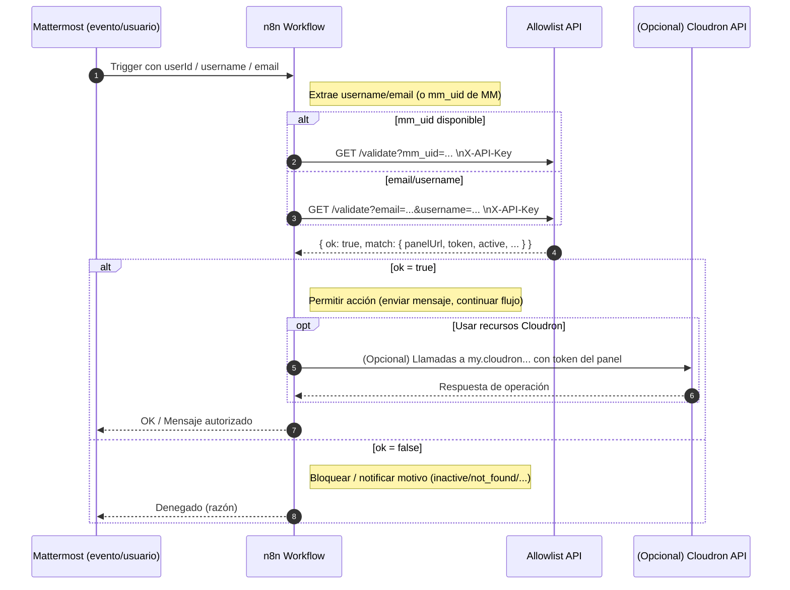
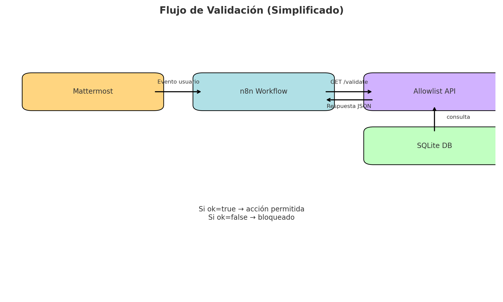
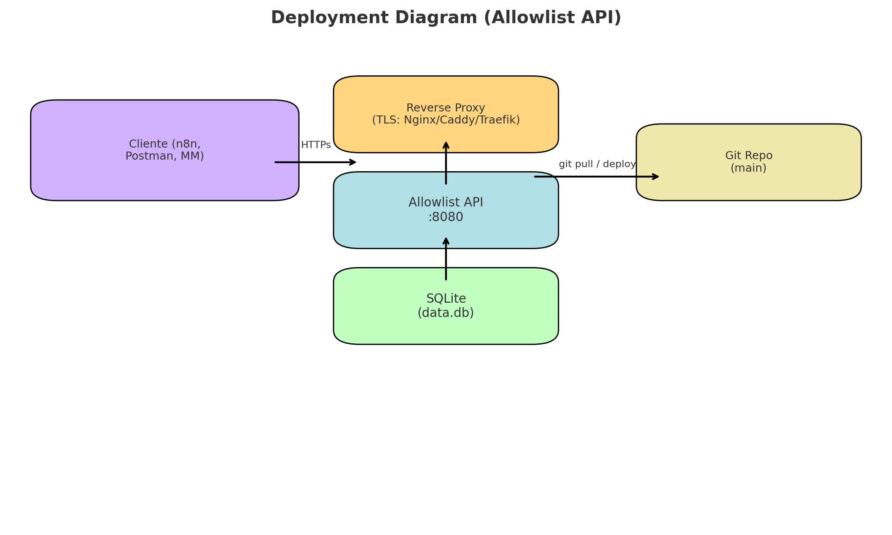

# 📋 Allowlist API

API ligera en **Node.js + SQLite** para gestionar una lista de usuarios autorizados (`username`, `email`, `mm_uid`).  
Incluye validación (`/validate`), cifrado opcional de tokens, seguridad básica (API Key, CORS, rate limit) y documentación vía **OpenAPI + Swagger UI**.

---

## ⚡ Instalación

### 1. Clonar repositorio
```bash
cd /opt
git clone -b reloaded https://github.com/akzeronet/allowlist-api.git
cd allowlist-api
```

### 2. Configurar variables de entorno

> Edita docker-compose.yml o crea un .env con:
```
API_KEY=pon-una-clave-larga-y-aleatoria
API_KEY_OLD=
ENC_KEY= # opcional: `openssl rand -hex 32` para cifrar tokens
ENC_KEY_OLD=
CORS_ORIGINS=https://mi-n8n.com,https://panel.miempresa.com
VALIDATE_DOMAIN= # opcional: ej. empresa.com
DB_PATH=/app/data/data.db
APP_MODE=1   # 1=production, 2=development
TZ=America/Santo_Domingo
```

### 3. Construir imagen
``` docker compose build ```

### ▶️ Uso con Docker
Levantar contenedor
``` docker compose up -d ```

Ver logs
``` docker logs -f allowlist-api ```

Detener contenedor
``` docker compose down ```

Actualizar tras cambios en repo
``` git pull origin realoaded  # esta rama```
``` docker compose build ```
``` docker compose up -d ```

* La base de datos (data.db) se guarda en ./data (mapeada como volumen).

## 📡 Endpoints principales

* GET /health → prueba de vida
* GET /entries → lista entradas (filtros: email, username, domain, paginación)
* POST /entries → crea nueva entrada (409 si username/email/mm_uid ya existen)
* GET /entries/{id} → obtiene una entrada por id
* PUT /entries/{id} → actualiza entrada por id (409 si conflicto de unicidad)
* DELETE /entries/{id} → elimina entrada
* GET /entries/lookup → busca por id, username, email, mm_uid
* POST /entries/bulk → alta masiva, reporta conflictos por item
* GET /validate → valida si usuario es activo + pertenece al dominio (opcional)

### Documentación interactiva
- Swagger UI: /docs
- OpenAPI JSON: /openapi.json
- Redoc: /redoc (opcional)

> Autenticación: enviar X-API-Key en headers (excepto /health).

## ✨ Características principales
- SQLite + WAL → rápido y sin dependencias externas.
- Campos únicos: username, email, mm_uid (además de id autoincremental).
- API Key con rotación (API_KEY + API_KEY_OLD).
- Cifrado de tokens (AES-256-GCM) vía ENC_KEY (opcional).
- Rate limiting y CORS estricto.
- OpenAPI 3.0.3 con Swagger UI integrada.

## 🔌 Integración n8n (mínima)

> Ejemplo: validar un usuario desde Mattermost → Cloudron → Allowlist API.

* Nodo HTTP Request en n8n:
Método: GET
URL:
http://TU_API/validate?email={{$json.email}}&username={{$json.username}}
Headers:
X-API-Key: TU_API_KEY

Response: JSON

Nodo IF: condición ={{$json.ok}}
Si true → acceso permitido
Si false → rechazar


## 🧩 Diagrama de flujo

### 1) Secuencia de validación (Mattermost → n8n → Allowlist API)



```
flowchart LR
  subgraph Client
    U[Usuario / Sistemas] -->|HTTP(s)| RP[(Reverse Proxy TLS)] 
  end

  subgraph Server
    RP --> SVC[Allowlist API :8080]
    SVC --> DB[(SQLite data.db)]
  end

  subgraph CI/CD
    GH[Repo Git] -->|git pull| Host
  end

  classDef svc fill:#EEF,stroke:#88A,stroke-width:1px;
  classDef db fill:#EFE,stroke:#7A7,stroke-width:1px;
  class SVC svc
  class DB db
```

## 🖼️ Diagramas

### Flujo de validación


### Deployment



## 🖥️ Instalación en Easypanel
1. New App → Dockerfile App
2. Conectar repo → path . → Dockerfile por defecto
3. Env Vars: igual que en .env
4. Puerto interno: 8080
5. Volumen: mapear /app/data → persistencia
6. Deploy y prueba /health

## 📈 Siguientes mejoras opcionales (To Do)
* Rotación de claves ENC_KEY con soporte de “keyring” múltiple
* Web UI simple (CRUD manual protegido con login básico)
* Integración con sistemas externos (ej. Cloudron, Gitea) vía hooks
* Tests automáticos (Jest/Supertest)
* Exportación/importación CSV de entradas
* Soporte multi-tenancy (namespaces/empresas)
* Triggers para evitar múltiples NULL en mm_uid (si se requiere)

### 🛠️ Licencia
AGPL v3 — Uso libre, contribuciones bienvenidas.
